# Architecture Documentation

This document provides a technical overview of the Immich-Viewer architecture for developers and contributors.

## Table of Contents

1. [Overview](#overview)
2. [Architecture Patterns](#architecture-patterns)
3. [Advanced Patterns](#advanced-patterns)
4. [Service Layer](#service-layer)
5. [Data Models](#data-models)
6. [Storage Architecture](#storage-architecture)
7. [Authentication Flow](#authentication-flow)
8. [Network Layer](#network-layer)
9. [Error Handling](#error-handling)
10. [UI Architecture](#ui-architecture)
11. [Components and Protocols](#components-and-protocols)
12. [Concurrency Model](#concurrency-model)
13. [Top Shelf Extension](#top-shelf-extension)
14. [Performance Considerations](#performance-considerations)

---

## Overview

Immich-Viewer follows a **service-oriented MVVM architecture** with clear separation between:

- **Presentation Layer**: SwiftUI views and view models
- **Business Logic Layer**: Service classes
- **Data Layer**: Storage and network abstractions
- **Infrastructure Layer**: Caching, persistence, and utilities

---

## Architecture Patterns

### Dependency Injection

All services are initialized in `ContentView` and passed down to child views through constructor-based dependency injection:

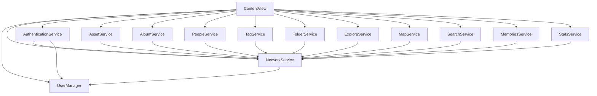

**Key Principles:**
- Services are created once using `@StateObject` in `ContentView`
- Dependencies flow downward through initializers
- No global singletons or service locators
- Clear dependency hierarchy enables testing with mock services

### Observable Pattern

Services and view models use `@Published` properties and `ObservableObject` to notify views of state changes:

- `UserManager`: `@Published var savedUsers`, `@Published var currentUser`
- `AuthenticationService`: `@Published var isAuthenticated`, `@Published var currentUser`
- View models: Loading states, error messages, data collections

### Protocol-Oriented Design

Storage abstraction via protocols enables testing and future migration:

```swift
protocol UserStorage {
    func saveUser(_ user: SavedUser) throws
    func loadUsers() -> [SavedUser]
    func removeUser(withId id: String) throws
}
```

---

## Advanced Patterns

### Asset Provider Pattern

Protocol-based abstraction for different asset loading strategies, enabling optimized data fetching based on context.

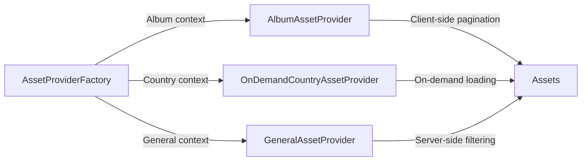

**Protocol Definition:**

```swift
protocol AssetProvider {
    func fetchAssets(page: Int, pageSize: Int) async throws -> [ImmichAsset]
    var totalCount: Int? { get }
}
```

**Implementations:**

- **AlbumAssetProvider**: Client-side pagination for albums (fetches all assets once, pages locally)
- **OnDemandCountryAssetProvider**: Optimized for country-based browsing with server-side pagination
- **GeneralAssetProvider**: Server-side filtering for searches, tags, people, folders

**Benefits:**
- Optimized loading strategy per context
- Consistent interface across different data sources
- Easy to test with mock providers
- Reduces unnecessary API calls

### Error Boundary Pattern

Global error handling system that catches and displays errors gracefully across the app.

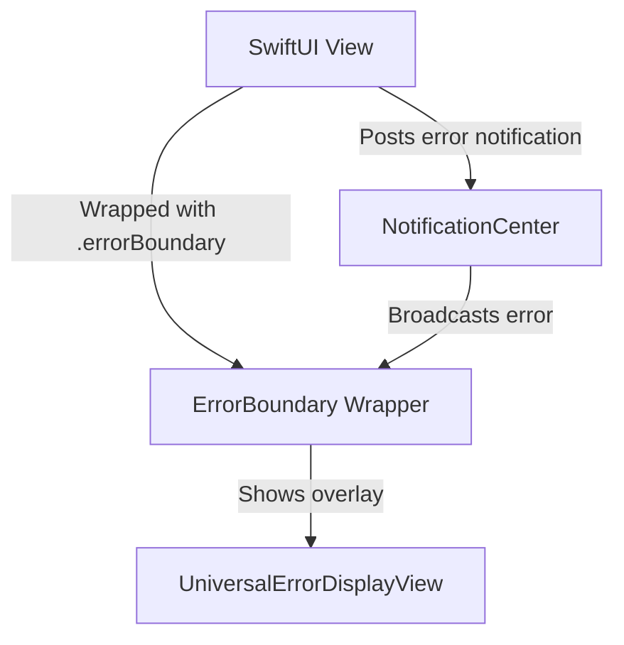

**Usage:**

```swift
ContentView()
    .errorBoundary(context: "Main App")
```

**Features:**
- Context-aware error messages
- Automatic error dismissal
- User-friendly error descriptions
- Prevents app crashes from unhandled errors

### Thumbnail Provider System

Unified thumbnail loading interface for different entity types.

**Protocol:**

```swift
protocol ThumbnailProvider {
    func loadThumbnail(for item: GridDisplayable, 
                      size: CGSize) async throws -> UIImage?
}
```

**Implementations:**
- `AlbumThumbnailProvider`
- `PeopleThumbnailProvider`
- `TagThumbnailProvider`
- `FolderThumbnailProvider`
- `ContinentThumbnailProvider`
- `CountryThumbnailProvider`

**Benefits:**
- Consistent thumbnail loading across different views
- Shared caching infrastructure
- Easy to extend for new entity types

### Spatial Indexing for Maps

Efficient geographic querying for map markers using grid-based spatial indexing.

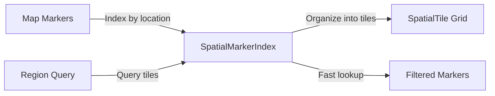

**Key Components:**

- **SpatialTile**: Grid-based tile system dividing the world into regions
- **SpatialMarkerIndex**: Efficient index for querying markers by region
- **MapClusterer**: Clustering algorithm to group nearby markers

**Performance:**
- O(1) tile lookup instead of O(n) linear search
- Handles thousands of markers efficiently
- Reduces rendering overhead on map views

---

## Service Layer

### UserManager

Centralized user account management.

**Responsibilities:**
- Managing multiple user accounts
- Authentication (password and API key)
- User switching and persistence
- Token management via Keychain

### NetworkService

HTTP client for Immich API.

**Key Features:**
- Dynamic header switching (JWT vs API key)
- Automatic credential loading from UserManager
- Comprehensive error handling and classification

### AuthenticationService

Authentication state management.

**Responsibilities:**
- Tracking authentication status
- User info fetching and validation
- Token validation and logout handling

### AssetService

Photo and video operations.

**Key Methods:**
- `fetchAssets()` — Search with filters (album, person, tag, city, folder)
- `fetchRandomAssets()` — Random selection for slideshows
- `loadImage()` — Thumbnail loading with caching
- `loadFullImage()` — Full-size image with RAW support
- `loadVideoURL()` — Video playback URL construction

**RAW Support:** Detects RAW formats (DNG, CR2, NEF, ARW, ORF, RAF) and uses server-provided previews.

### AlbumService

Album operations including personal and shared albums.

### PeopleService

Face recognition and people management with animated thumbnail previews.

### TagService

Tag management and tag-based photo retrieval.

### FolderService

Folder navigation with grid, tree, and timeline view support.

### ExploreService

Discovery features including city-based grouping and statistics.

### MapService

Geographic data and map operations.

**Key Methods:**
- `fetchMapMarkers()` — Lightweight markers for fast initial load
- `fetchAssetsInRegion()` — On-demand asset loading for specific regions
- 5-minute cache for map data

### MemoriesService

"On This Day" memories feature, fetching photos from previous years on the current date.

### SearchService

AI-powered contextual search across assets using Immich's CLIP integration.

### StatsService

Library statistics including photo/video counts and storage usage.

### ThumbnailCache

Two-tier caching system for thumbnail images.

**Architecture:**

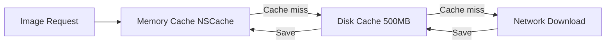

**Key Features:**
- **Memory Cache**: NSCache with 100MB limit, automatic eviction under memory pressure
- **Disk Cache**: 500MB limit with LRU cleanup strategy
- **Expiration**: 7-day automatic cleanup for stale entries
- **Statistics**: `@Published` properties for cache hits/misses and size tracking
- **Preloading**: Support for preloading thumbnails for better performance

**Cache Locations:**
- Memory: In-process NSCache
- Disk: `.cachesDirectory/thumbnails/`

### StatsCache

Session-based cache for library statistics with disk persistence.

**Features:**
- 24-hour expiry for cached statistics
- Disk persistence for faster app launches
- Reduces API calls for frequently accessed data
- Automatic invalidation on data changes

**Storage:**
- Cached in `.cachesDirectory/stats_cache.json`

### ImageColorExtractor

Extracts dominant colors from images for visual effects.

**Use Cases:**
- Ambilight backgrounds in slideshows
- Dynamic theme colors
- Visual consistency

**Methods:**
- `extractDominantColor(from:)` — Async color extraction
- `extractDominantColorSync(from:)` — Synchronous extraction
- Color quantization algorithm for accurate results

### AssetProvider

See [Asset Provider Pattern](#asset-provider-pattern) in Advanced Patterns section.

### MockImmichService

Comprehensive mock service implementations for testing and SwiftUI previews.

**Provided Mocks:**
- `MockNetworkService`
- `MockAuthenticationService`
- `MockAssetService`
- `MockAlbumService`
- `MockTagService`
- `MockFolderService`
- `MockPeopleService`

**Factory:**

```swift
MockServiceFactory.createMockServices()
```

**Benefits:**
- Enables SwiftUI previews without live server
- Facilitates unit testing
- Provides realistic sample data

---

## Data Models

### ImmichAsset

Core model representing a photo or video:

```swift
struct ImmichAsset: Codable, Identifiable, Equatable {
    let id: String
    let type: AssetType  // IMAGE, VIDEO, AUDIO, OTHER
    let isFavorite: Bool
    let exifInfo: ExifInfo?
    let people: [Person]
    // ... metadata fields
}
```

### SavedUser

User account model for multi-user support:

```swift
struct SavedUser: Codable, Identifiable {
    let id: String  // Base64(email@serverURL)
    let email: String
    let name: String
    let serverURL: String
    let authType: AuthType  // .jwt or .apiKey
    let profileImageData: Data?
}
```

### Memory

"On This Day" memory model:

```swift
struct Memory: Identifiable {
    let id: String
    let title: String
    let date: Date
    let assets: [ImmichAsset]
    var coverAsset: ImmichAsset?
}
```

### GridDisplayable Protocol

Unified interface for grid items (albums, people, tags, folders, continents):

```swift
protocol GridDisplayable: Identifiable {
    var primaryTitle: String { get }
    var secondaryTitle: String? { get }
    var thumbnailId: String? { get }
    var itemCount: Int? { get }
    var iconName: String? { get }
    var gridColor: Color? { get }
}
```

**Conforming Types:**
- `ImmichAlbum`
- `Person`
- `Tag`
- `ImmichFolder`
- `Continent`
- `Country`

### Location Models

Hierarchical location data structures for geographic browsing.

**Continent:**

```swift
struct Continent: Identifiable, GridDisplayable {
    let id: String
    let name: String
    let countries: [Country]
    var assetCount: Int
}
```

**Country:**

```swift
struct Country: Identifiable, Codable {
    let name: String
    let assetCount: Int
}
```

**ContinentMapper:**
- Utility for mapping country names to continents
- Supports 195+ countries
- Handles edge cases and territories

**LocationSummary:**
- Lightweight location data for efficient queries
- Used in explore views and map clustering

### Map Models

Specialized models for map functionality and spatial indexing.

**MapMarker:**

```swift
struct MapMarker: Identifiable {
    let id: String
    let latitude: Double
    let longitude: Double
    let assetCount: Int
}
```

**SpatialTile:**
- Grid-based tile system for spatial indexing
- Divides world into manageable regions
- Enables O(1) region lookups

**PhotoCluster:**
- Represents clustered photos on map
- Contains asset references and center coordinate
- Used for map annotation rendering

**SpatialMarkerIndex:**
- Efficient spatial index for marker queries
- Grid-based organization
- Fast region-based filtering

### Memory Models

Models for "On This Day" memories feature.

**ImmichMemoryResponse:**

```swift
struct ImmichMemoryResponse: Codable {
    let count: Int
    let assets: [ImmichAsset]
}
```

**ExploreViewMode:**

```swift
enum ExploreViewMode {
    case places
    case memories
}
```

---

## Storage Architecture

### HybridUserStorage

Combines two storage mechanisms for secure and accessible user data management.

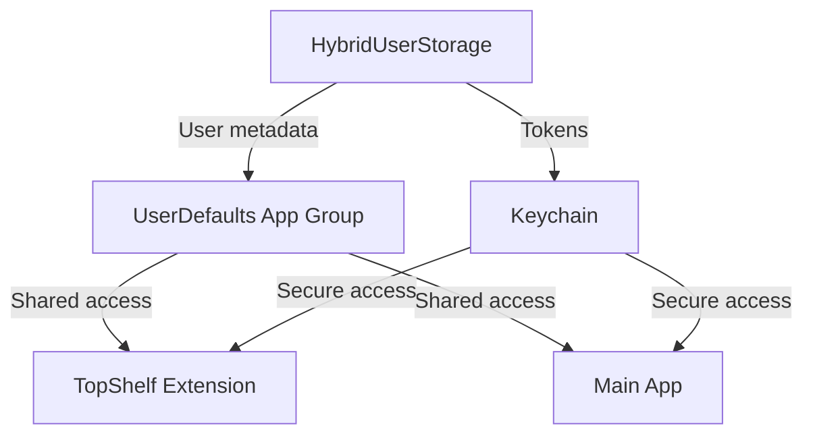

**Storage Layers:**

1. **UserDefaults (App Group)**
   - User account metadata (email, name, server URL, auth type)
   - Profile image data
   - Current active user ID
   - App settings and preferences
   - **Shared with**: TopShelf extension via App Group container

2. **Keychain**
   - Authentication tokens (JWT or API keys)
   - Secure, encrypted storage
   - Persists across app reinstalls
   - **Shared with**: TopShelf extension via Keychain access groups

### Protocol-Based Design

**UserStorage Protocol:**

```swift
protocol UserStorage {
    func saveUser(_ user: SavedUser) throws
    func loadUsers() -> [SavedUser]
    func removeUser(withId id: String) throws
    func getCurrentUserId() -> String?
    func setCurrentUserId(_ id: String?)
}
```

**UserStorageWithTokens Protocol:**

```swift
protocol UserStorageWithTokens: UserStorage {
    func saveToken(_ token: String, forUserId userId: String) throws
    func loadToken(forUserId userId: String) -> String?
    func removeToken(forUserId userId: String) throws
}
```

**Implementation:**

```swift
class HybridUserStorage: UserStorageWithTokens {
    private let userDefaults: UserDefaults
    private let keychainStorage: KeychainTokenStorage
    
    // Combines both storage mechanisms
}
```

### Storage Keys

**UserDefaults Keys:**
- User data: `immich_user_{userID}` → JSON-encoded SavedUser
- Current user: `currentActiveUserId` → User ID string
- App Group ID: `group.com.immich.viewer`

**Keychain Keys:**
- Token: `immich_token_{userID}` → Token string
- Service: `com.immich.viewer.tokens`
- Access Group: Shared with TopShelf extension

### Migration System

`StorageMigration.swift` handles one-time migration from standard UserDefaults to App Group for backward compatibility.

**Migration Process:**

1. Check if migration is needed (old UserDefaults has data, App Group is empty)
2. Copy all user data from standard UserDefaults to App Group
3. Verify migration success
4. Mark migration as complete
5. Clean up old data (optional)

**Error Handling:**

```swift
enum MigrationError: Error {
    case verificationFailed
    case copyFailed
}
```

### Keychain Security

**Security Features:**
- Data encrypted at rest
- Access controlled by iOS
- Persists across app reinstalls
- Shared securely between app and extension

**Access Control:**
- `kSecAttrAccessibleAfterFirstUnlock` — Available after device unlock
- Access group sharing for TopShelf extension
- Automatic cleanup on user deletion

---

## Authentication Flow

### Dual Authentication Support

The app supports two authentication methods with dynamic header switching.

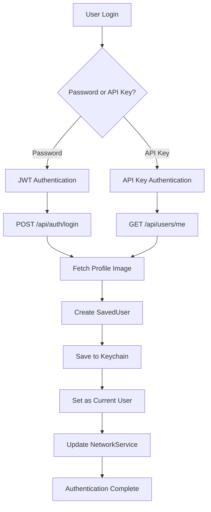

### Password Authentication (JWT)

**Flow:**

1. User enters email + password
2. POST `/api/auth/login` → Returns JWT token
3. Fetch user profile image via `/api/users/me/profile-image`
4. Create `SavedUser` with `authType: .jwt`
5. Save JWT token to Keychain
6. Set as current user in UserDefaults
7. Update NetworkService credentials
8. Post authentication notification

**Headers:**

```swift
Authorization: Bearer {jwt_token}
```

### API Key Authentication

**Flow:**

1. User enters email + API key
2. GET `/api/users/me` (with `x-api-key` header) → Validates key
3. Fetch user profile image
4. Create `SavedUser` with `authType: .apiKey`
5. Save API key to Keychain
6. Set as current user in UserDefaults
7. Update NetworkService credentials

**Headers:**

```swift
x-api-key: {api_key}
```

### Dynamic Header Switching

`NetworkService` automatically switches authentication headers based on current user's auth type:

```swift
func getAuthHeaders() -> [String: String] {
    guard let authType = currentAuthType else { return [:] }
    
    switch authType {
    case .jwt:
        return ["Authorization": "Bearer \(token)"]
    case .apiKey:
        return ["x-api-key": "\(token)"]
    }
}
```

### User Switching

Multi-user account switching with proper credential and session management.

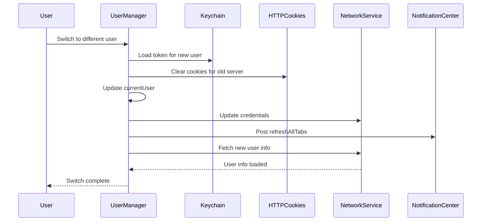

**Steps:**

1. Load token from Keychain for selected user
2. Clear HTTP cookies for previous server (prevents session conflicts)
3. Update `currentUser` in UserManager
4. Update NetworkService credentials (auth type + token)
5. Post `refreshAllTabs` notification to refresh all views
6. Fetch new user info to validate authentication
7. Update UI with new user data

**Cookie Management:**

```swift
// Clear cookies for old server to prevent conflicts
if let oldURL = URL(string: oldServerURL) {
    HTTPCookieStorage.shared.cookies(for: oldURL)?.forEach {
        HTTPCookieStorage.shared.deleteCookie($0)
    }
}
```

### Token Validation

Automatic token validation on app launch and user switching:

- Fetch `/api/users/me` to validate token
- On 401/403 errors, trigger logout
- Update authentication state accordingly

---

## Network Layer

### Request Building

`NetworkService.buildAuthenticatedRequest()`:
1. Validates credentials exist
2. Constructs full URL (baseURL + endpoint)
3. Sets HTTP method and auth header
4. Adds JSON body if provided

### Error Classification

```swift
enum ImmichError: Error {
    case notAuthenticated  // 401 - triggers logout
    case forbidden         // 403 - triggers logout
    case serverError(Int)  // 5xx - preserves auth
    case networkError      // Connection issues
    case clientError(Int)  // 4xx - request error
    case invalidURL        // Malformed URL
}
```

**Error Properties:**

```swift
extension ImmichError {
    var shouldLogout: Bool {
        switch self {
        case .notAuthenticated, .forbidden:
            return true
        default:
            return false
        }
    }
}
```

---

## Error Handling

### Error Boundary System

Global error handling infrastructure that catches and displays errors gracefully.

**Architecture:**

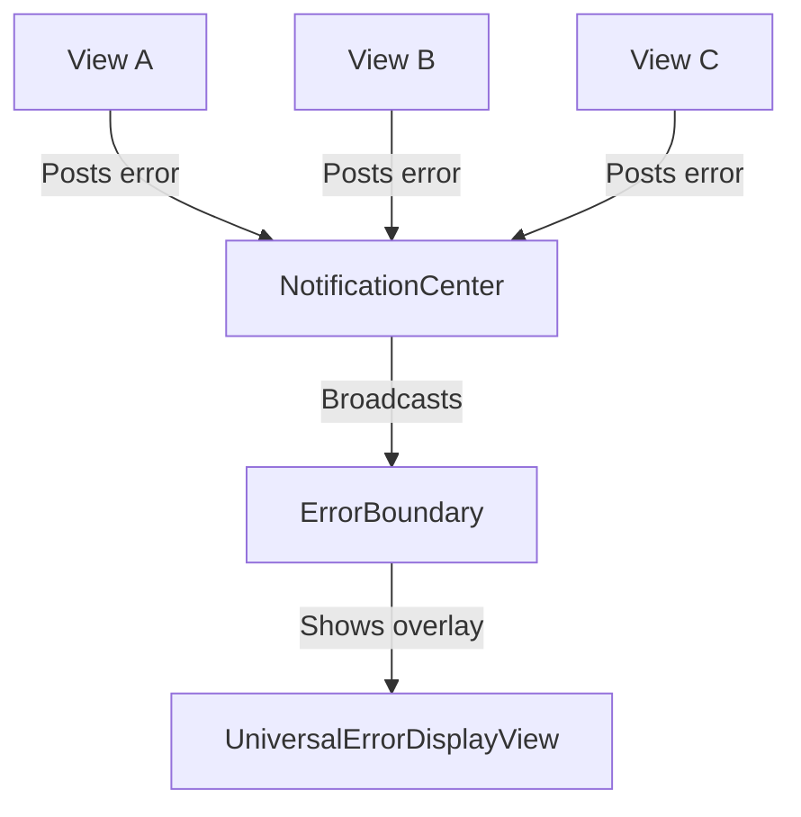

**Usage:**

```swift
ContentView()
    .errorBoundary(context: "Main Application")
```

**Error Notification:**

```swift
NotificationCenter.default.post(
    name: .universalErrorOccurred,
    object: nil,
    userInfo: [
        "error": error,
        "context": "Asset Loading"
    ]
)
```

### User-Friendly Error Messages

Errors are translated to user-friendly messages via `LocalizedError` conformance:

```swift
extension ImmichError: LocalizedError {
    var errorDescription: String? {
        switch self {
        case .notAuthenticated:
            return "Your session has expired. Please sign in again."
        case .networkError:
            return "Unable to connect to server. Check your connection."
        case .serverError(let code):
            return "Server error (\(code)). Please try again later."
        // ... more cases
        }
    }
}
```

### Error Recovery

**Automatic Recovery:**
- 401/403 errors trigger automatic logout and redirect to sign-in
- Network errors show retry option
- Server errors preserve authentication state

**Manual Recovery:**
- Error overlay includes dismiss button
- Context-specific recovery suggestions
- Automatic dismissal after timeout

---

## UI Architecture

### View Hierarchy

```
Immich_ViewerApp
└── ContentView
    ├── SignInView (if not authenticated)
    └── TabView (if authenticated)
        ├── AssetGridView (Photos)
        ├── AlbumListView (optional)
        ├── PeopleGridView
        ├── TagsGridView (optional)
        ├── FoldersView (optional)
        ├── ExploreView
        │   ├── Places (continents → countries → cities)
        │   └── Memories (On This Day)
        ├── WorldMapView (optional)
        ├── SearchView
        └── SettingsView
            ├── Interface
            ├── Slideshow
            ├── Sorting
            ├── Top Shelf
            ├── Account
            ├── Statistics
            └── About
```

### Navigation Styles

Two navigation styles supported via `NavigationStyle` enum:
- **Tabs**: Traditional tab bar navigation
- **Sidebar**: Sidebar-style navigation (tvOS 15+)

### View Models

View models bridge services and views, managing state and business logic:

| ViewModel | Purpose | Key Features |
|-----------|---------|--------------|
| `AssetGridViewModel` | Asset grid state and pagination | Infinite scrolling, filtering, sorting |
| `SlideshowViewModel` | Slideshow logic, Ken Burns effect, timing | Animation control, shuffle mode, ambilight |
| `WorldMapViewModel` | Map markers, region loading, clustering | Spatial indexing, on-demand loading |
| `ExploreViewModel` | Statistics and continent-based exploration | Data aggregation, location hierarchy |
| `MemoriesViewModel` | "On This Day" memories loading | Date-based filtering, asset grouping |
| `SearchViewModel` | Search queries and results | CLIP integration, result pagination |
| `FullScreenImageViewModel` | Full-screen image viewing and navigation | Swipe gestures, EXIF overlay |
| `SignInViewModel` | Authentication form logic | Dual auth support, validation |
| `AlbumListViewModel` | Album list management | Loading states, album fetching |
| `PeopleGridViewModel` | People grid state | Person list management, face thumbnails |
| `TagsGridViewModel` | Tags grid state | Tag list management, filtering |
| `FoldersViewModel` | Folder navigation | Tree/grid/timeline view modes |
| `StatsViewModel` | Statistics display | Library stats, cache management |
| `ContinentViewModel` | Continent exploration | Country grouping, asset counts |
| `CountryViewModel` | Country asset viewing | Optimized asset provider usage |
| `SimpleVideoPlayerViewModel` | Video playback | Player state, controls, progress |

### State Management

- `@StateObject`: For service instances (created once)
- `@State`: For local view state
- `@AppStorage`: For UserDefaults-backed settings
- `NotificationCenter`: For cross-view communication (tab refresh, slideshow triggers)

### Error Boundary Integration

All major views are wrapped with error boundaries for graceful error handling:

```swift
TabView {
    AssetGridView()
        .errorBoundary(context: "Photos")
    
    AlbumListView()
        .errorBoundary(context: "Albums")
    
    // ... other tabs
}
```

### Conditional Tab Visibility

Tabs can be toggled via settings with automatic fallback:

```swift
@AppStorage("showAlbumsTab") private var showAlbumsTab = true
@AppStorage("showTagsTab") private var showTagsTab = false
@AppStorage("showFoldersTab") private var showFoldersTab = false
@AppStorage("showWorldMapTab") private var showWorldMapTab = false
```

**Behavior:**
- Tabs are shown/hidden based on user preferences
- If active tab is disabled, automatically switch to Photos tab
- Settings persist across app launches

### Deep Linking Implementation

URL scheme: `immichgallery://asset/{assetId}`

**Flow:**

1. URL received in `Immich_ViewerApp.onOpenURL()`
2. Extract asset ID from URL
3. Post notification with asset ID
4. `ContentView` receives notification
5. Switch to Photos tab
6. Navigate to full-screen view of asset

**Code:**

```swift
.onOpenURL { url in
    if url.scheme == "immichgallery",
       url.host == "asset",
       let assetId = url.pathComponents.last {
        NotificationCenter.default.post(
            name: .openAsset,
            object: assetId
        )
    }
}
```

### Auto-Slideshow Mechanism

Automatic slideshow activation after user inactivity.

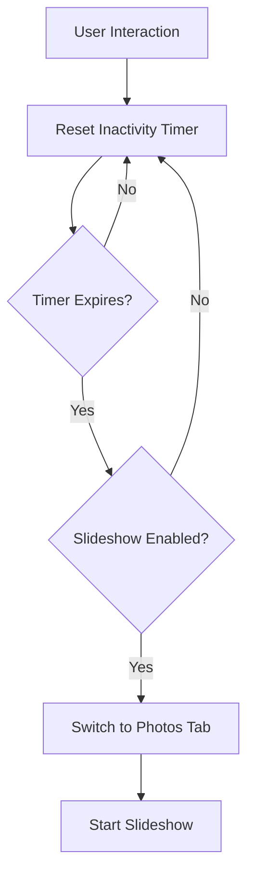

**Configuration:**
- Timeout configurable in Settings (0 = disabled, 1-60 minutes)
- Timer resets on any user interaction (tap, swipe, button press)
- Automatically switches to Photos tab
- Posts notification to trigger slideshow

**Implementation:**

```swift
@AppStorage("autoSlideshowTimeout") private var timeout = 0

private func resetInactivityTimer() {
    inactivityTimer?.invalidate()
    guard timeout > 0 else { return }
    
    inactivityTimer = Timer.scheduledTimer(
        withTimeInterval: TimeInterval(timeout * 60),
        repeats: false
    ) { _ in
        startAutoSlideshow()
    }
}
```

### Notification-Based Communication

Cross-view communication via NotificationCenter:

| Notification | Purpose | Payload |
|--------------|---------|---------|
| `refreshAllTabs` | Refresh all tab content | None |
| `universalErrorOccurred` | Global error display | Error + context |
| `openAsset` | Deep link to asset | Asset ID |
| `startSlideshow` | Trigger slideshow | None |
| `stopSlideshow` | Stop slideshow | None |

---

## Components and Protocols

### SharedGridView

Reusable grid component for displaying collections of items.

**Features:**
- Consistent grid layout across different entity types
- Lazy loading for performance
- Thumbnail loading with caching
- Item count badges
- Loading states

**Usage:**

```swift
SharedGridView(
    items: albums,
    thumbnailProvider: AlbumThumbnailProvider(assetService: assetService),
    onItemTap: { album in
        // Handle tap
    }
)
```

### GridDisplayable Protocol

Unified interface enabling different types to be displayed in grids.

**Protocol:**

```swift
protocol GridDisplayable: Identifiable {
    var primaryTitle: String { get }
    var secondaryTitle: String? { get }
    var thumbnailId: String? { get }
    var itemCount: Int? { get }
    var iconName: String? { get }
    var gridColor: Color? { get }
}
```

**Conforming Types:**
- `ImmichAlbum` — Album name, asset count, cover photo
- `Person` — Person name, face count, face thumbnail
- `Tag` — Tag name, asset count, first asset thumbnail
- `ImmichFolder` — Folder path, asset count, first asset thumbnail
- `Continent` — Continent name, country count, representative photo
- `Country` — Country name, asset count, representative photo

### ThumbnailProvider Protocol

Abstraction for loading thumbnails from different sources.

**Protocol:**

```swift
protocol ThumbnailProvider {
    func loadThumbnail(
        for item: GridDisplayable,
        size: CGSize
    ) async throws -> UIImage?
}
```

**Implementations:**
- `AlbumThumbnailProvider` — Loads album cover photos
- `PeopleThumbnailProvider` — Loads face thumbnails
- `TagThumbnailProvider` — Loads first tagged asset
- `FolderThumbnailProvider` — Loads first folder asset
- `ContinentThumbnailProvider` — Loads representative continent photo
- `CountryThumbnailProvider` — Loads representative country photo

**Benefits:**
- Consistent thumbnail loading across views
- Shared caching infrastructure
- Easy to test with mock providers
- Extensible for new entity types

### Gesture Components

**SwipeGestureView:**
- Wraps views with swipe gesture handling
- Configurable swipe directions
- Callback-based action handling

**MapPanGestureView:**
- Custom pan gesture for map interactions
- Prevents conflicts with map's built-in gestures
- Smooth panning experience

### Overlay Components

**ExifInfoOverlay:**
- Displays photo metadata (camera, lens, settings)
- Toggleable visibility
- Formatted display of technical information

**LockScreenStyleOverlay:**
- Lock screen-style photo display
- Date and time overlay
- Elegant typography and layout

---

## Concurrency Model

### MainActor Usage

UI-bound services and view models are marked with `@MainActor` to ensure thread safety.

**Services:**

```swift
@MainActor
class AuthenticationService: ObservableObject {
    @Published var isAuthenticated = false
    @Published var currentUser: User?
    
    // All methods run on main thread
}
```

**View Models:**

```swift
@MainActor
class AssetGridViewModel: ObservableObject {
    @Published var assets: [ImmichAsset] = []
    @Published var isLoading = false
    
    // UI updates are always on main thread
}
```

### Async/Await Patterns

Modern Swift concurrency throughout the codebase.

**Service Methods:**

```swift
func fetchAssets() async throws -> [ImmichAsset] {
    let request = try buildAuthenticatedRequest(...)
    let (data, response) = try await URLSession.shared.data(for: request)
    return try JSONDecoder().decode([ImmichAsset].self, from: data)
}
```

**View Model Usage:**

```swift
func loadData() {
    Task {
        isLoading = true
        defer { isLoading = false }
        
        do {
            assets = try await assetService.fetchAssets()
        } catch {
            handleError(error)
        }
    }
}
```

### Background Processing

Long-running operations use `Task.detached` for background execution.

**Image Processing:**

```swift
Task.detached {
    let color = await ImageColorExtractor.extractDominantColor(from: image)
    await MainActor.run {
        self.backgroundColor = color
    }
}
```

**Cache Cleanup:**

```swift
Task.detached(priority: .background) {
    await thumbnailCache.cleanupExpiredEntries()
}
```

### Thread Safety Guarantees

**Published Properties:**
- All `@Published` properties updated on main thread
- Automatic UI updates via Combine

**State Updates:**

```swift
await MainActor.run {
    self.isAuthenticated = true
    self.currentUser = user
}
```

**Nonisolated Methods:**

```swift
nonisolated func buildURL(endpoint: String) -> URL? {
    // Can be called from any thread
    return URL(string: baseURL + endpoint)
}
```

---

## Top Shelf Extension

### Architecture

Separate process that:
1. Loads current user from shared UserDefaults
2. Retrieves token from Keychain
3. Fetches photos from Immich API
4. Downloads and processes images
5. Creates `TVTopShelfContent`

### Content Types

- **Carousel**: Horizontal scrolling fullscreen carousel
- **Sectioned**: Compact grid-style sections

### Image Selection

- **Recent**: Latest landscape photos
- **Random**: Random landscape selection

### Deep Linking

Photos link to: `immichgallery://asset/{assetId}`
- Opens app and navigates to specific photo
- Handled in `Immich_ViewerApp.onOpenURL()`

---

## Performance Considerations

### Image Loading

- **Thumbnails**: WebP format, cached in memory and disk
- **Full Images**: Progressive loading with fallback
- **RAW Images**: Server-converted previews
- **Video Thumbnails**: Cached preview images

### Caching Strategy

Comprehensive multi-tier caching system for optimal performance.

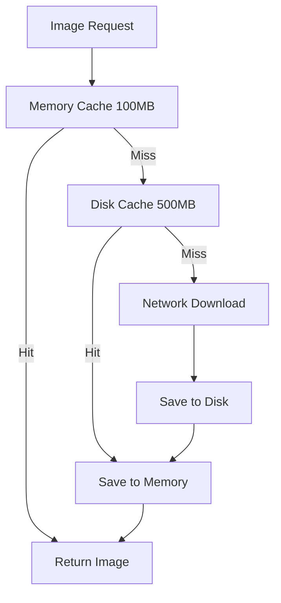

| Cache | Purpose | Size Limit | Expiration | Cleanup Strategy |
|-------|---------|------------|------------|------------------|
| `ThumbnailCache` (Memory) | Hot thumbnail cache | 100MB | Session | NSCache auto-eviction |
| `ThumbnailCache` (Disk) | Persistent thumbnails | 500MB | 7 days | LRU cleanup |
| `StatsCache` | Library statistics | ~1KB | 24 hours | Time-based |
| `MapService` | Map markers | Memory only | 5 minutes | Time-based |
| TopShelf | Extension images | ~50MB | Per update | Manual cleanup |

### Cache Cleanup Policies

**ThumbnailCache:**
- **Memory**: Automatic eviction by NSCache under memory pressure
- **Disk**: LRU (Least Recently Used) cleanup when exceeding 500MB
- **Expiration**: Files older than 7 days automatically removed
- **Manual**: Cache can be cleared via Settings

**StatsCache:**
- **Time-based**: Invalidated after 24 hours
- **Event-based**: Cleared on user switch or logout
- **Disk persistence**: Survives app restarts for faster launches

**MapService:**
- **Time-based**: 5-minute in-memory cache
- **Region-based**: Separate cache per map region
- **Automatic**: Cleared on memory warnings

### Memory Management

**Resource Cleanup:**
- Proper cleanup of timers and observers in `deinit`
- Image data released when views disappear
- Weak references to prevent retain cycles
- Automatic NSCache eviction under memory pressure

**Pagination:**
- Server-side pagination prevents loading entire library
- Configurable page size (default: 100 assets)
- Infinite scrolling with on-demand loading
- Asset providers optimize pagination strategy per context

**Lazy Loading:**
- Map markers loaded on-demand for visible regions
- Thumbnails loaded only for visible grid items
- Full images loaded only when viewed
- Video thumbnails cached separately

**Batch Processing:**
- Large datasets processed in chunks
- Background queue for non-UI operations
- Progress tracking for long operations

### Preloading Strategies

**Thumbnail Preloading:**
- Next page of thumbnails preloaded during scroll
- Adjacent photos preloaded in full-screen view
- Configurable preload distance

**Smart Caching:**
- Recently viewed items prioritized in cache
- Frequently accessed items kept in memory
- Predictive preloading based on user behavior

### Asset Provider Optimizations

Different loading strategies optimized per context:

**AlbumAssetProvider:**
- Client-side pagination (fetch all once, page locally)
- Best for small to medium albums
- Reduces API calls for repeated access

**OnDemandCountryAssetProvider:**
- Server-side pagination with lazy loading
- Optimized for large country collections
- Loads only visible page of assets

**GeneralAssetProvider:**
- Server-side filtering and pagination
- Used for searches, tags, people, folders
- Efficient for complex queries

### Background Processing

- Network requests on background threads
- UI updates on main thread (`@MainActor`)
- Async/await for concurrent operations
- Background image processing and color extraction

### Map Performance

**Spatial Indexing Benefits:**
- O(1) tile lookup vs O(n) linear search
- Handles 10,000+ markers efficiently
- Fast region-based filtering
- Reduced rendering overhead

**Optimization Techniques:**
- Lightweight marker loading for fast initial render
- On-demand asset loading when zooming into regions
- Clustering to reduce annotation count (groups nearby markers)
- Coordinate validation to prevent invalid markers
- 5-minute cache for marker data
- Batch marker updates to reduce UI redraws

**Progressive Loading:**
1. Load lightweight markers (lat/lng/count only)
2. Display markers on map immediately
3. Load full asset data on-demand when user taps cluster
4. Cache results for subsequent access

---

## Thread Safety

### Main Thread Requirements

All UI updates must be on main thread:

```swift
await MainActor.run {
    self.isAuthenticated = true
    self.currentUser = user
}
```

### Background Operations

Network and storage operations run on background threads:

```swift
Task {
    let result = try await service.fetchData()
    await MainActor.run {
        self.data = result
    }
}
```

---

## Additional Features

### Auto-Slideshow

Automatic slideshow activation after user inactivity:
- Configurable timeout (in minutes, 0 = disabled)
- Switches to Photos tab automatically
- Timer resets on any user interaction
- Controlled via `NotificationCenter`

### Deep Linking

URL scheme support for opening specific assets:
- Format: `immichgallery://asset/{assetId}`
- Handled in `Immich_ViewerApp.onOpenURL()`
- Posts notification to `ContentView` for asset navigation

### Slideshow Features

- **Ken Burns Effect**: Pan and zoom animations
- **Ambilight Background**: Dynamic color-matched background
- **Shuffle Mode**: Randomize photo order
- **Reflections**: Optional reflection effects
- **Custom Intervals**: 3 seconds to 2 minutes
- **Pause/Resume**: Play/Pause button control

### Location Hierarchy

Hierarchical location browsing:
- **World Map**: Global view with clustered photo locations
- **Continent View**: Photos grouped by continent
- **Country View**: Photos within a specific country
- **City View**: Photos within a specific city

Location data is extracted from EXIF metadata.
