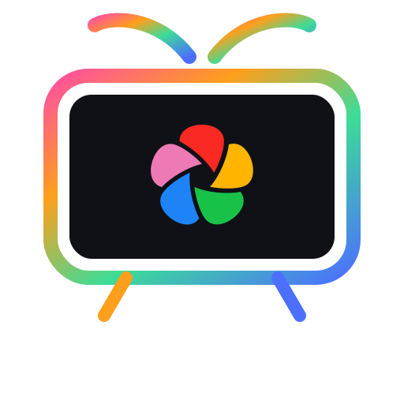

# Immich for Apple TV

  

**Turn your Apple TV into a beautiful digital photo frame** — browse, explore, and enjoy your self-hosted [Immich](https://immich.app) photo library on the big screen.

---

## 🎬 Get Started

**Join the Beta on TestFlight:**  
[https://testflight.apple.com/join/7nGMT7cz](https://testflight.apple.com/join/7nGMT7cz)

---

## ✨ Features

### 📸 Browse Your Memories

| Feature | Description |
|---------|-------------|
| **Photos** | View all your photos and videos in a stunning grid layout |
| **Albums** | Access personal and shared albums with beautiful cover images |
| **People** | Browse photos by person using Immich's smart face recognition |
| **Tags** | Find photos organized by your custom tags |
| **Folders** | Navigate your library using your original folder structure |
| **Favorites** | Quick access to your favorite moments |

### 🗺️ Explore & Discover

| Feature | Description |
|---------|-------------|
| **World Map** | See where your photos were taken on an interactive globe |
| **Explore** | Discover your library through cities, statistics, and highlights |
| **Search** | Find any photo or album instantly with powerful search |

### 🖼️ Slideshow — Your Digital Photo Frame

Transform your TV into an elegant photo frame with the built-in slideshow:

- **Ken Burns Effect** — Cinematic pan and zoom animations bring your photos to life
- **Auto-Start** — Automatically begins after a period of inactivity (configurable)
- **Shuffle Mode** — Randomize the order for variety
- **Customizable Timing** — Set how long each photo displays
- **Reflection Effects** — Optional elegant reflections beneath photos
- **Custom Backgrounds** — Choose your preferred backdrop color

### 🎥 Media Playback

- **High-Quality Viewing** — Full-resolution photos on your big screen
- **Video Support** — Watch your videos with the native player
- **RAW Support** — View RAW photos (automatically converted for display)
- **EXIF Details** — See camera info, date, location, and more with a single click

### 👥 Multi-Account Support

- **Multiple Users** — Add accounts for different family members or servers
- **Easy Switching** — Quickly switch between accounts
- **Flexible Login** — Sign in with email/password or API key

### 🎨 Customization

| Setting | Options |
|---------|---------|
| **Navigation Style** | Choose between tab bar or sidebar layout |
| **Visible Tabs** | Show or hide Albums, Tags, and Folders |
| **Default Tab** | Pick which view opens when you launch the app |
| **Top Shelf** | Display recent or random photos on your Apple TV home screen |
| **Clock Format** | 12-hour or 24-hour time display |
| **Slideshow Settings** | Timing, effects, background, and more |

### 📺 Top Shelf Integration

Your photos appear right on the Apple TV home screen:

- **Recent Photos** — Show your latest memories
- **Random Selection** — Surprise yourself with random picks
- **Two Styles** — Carousel (scrolling) or sectioned (grid) layout
- **Quick Access** — Click any photo to open it directly in the app

---

## 📋 Requirements

| Requirement | Details |
|-------------|---------|
| **Apple TV** | 4th generation or newer |
| **tvOS** | Version 15.0 or later |
| **Immich Server** | Any version accessible on your network |

---

## 🚀 Quick Setup

1. **Install** the app from TestFlight on your Apple TV
2. **Open** the app and enter your Immich server URL
3. **Sign in** with your email/password or API key
4. **Enjoy** your photos on the big screen!

> 💡 **Tip:** Your server URL typically looks like `http://192.168.1.x:2283` or `https://photos.yourdomain.com`

---

## 📖 For Developers

For technical architecture details, see [ARCHITECTURE.md](ARCHITECTURE.md).

---

## 📄 License

GPL-3.0 — See [LICENSE](LICENSE) for details.

---

## 🙏 Acknowledgments

- Built for [Immich](https://immich.app) — the self-hosted Google Photos alternative
- Forked from [mensadilabs/Immich-Gallery](https://github.com/mensadilabs/Immich-Gallery)
